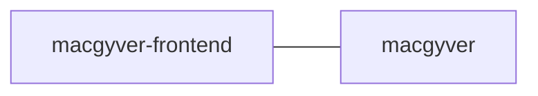

# macgyver-frontend
Frontend app for https://github.com/navikt/macgyver that fixes stuff like macgyver for team sykmelding

## Getting Started

### install dependencies
```bash
yarn
```

### build
```bash
yarn build
```

### run development server

```bash
yarn start
```

## FlowChart
This the high level flow of the application




## Contact

This project is maintained by navikt/teamsykmelding

Questions and/or feature requests? Please create an [issue](https://github.com/navikt/macgyver-frontend/issues).

If you work in [@navikt](https://github.com/navikt) you can reach us at the Slack
channel [#team-sykmelding](https://nav-it.slack.com/archives/CMA3XV997).