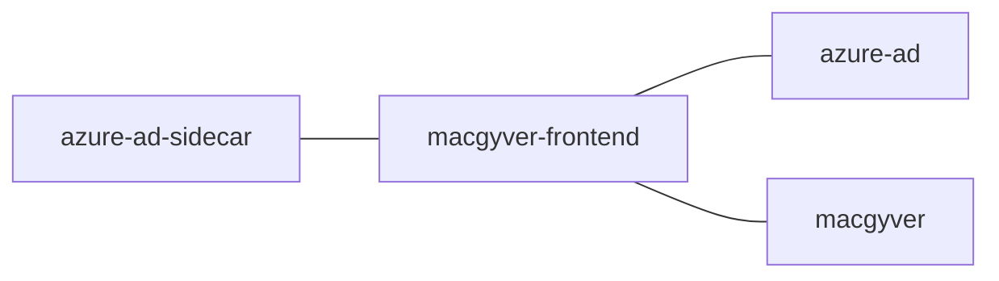

# macgyver-frontend
Frontend app for [macgyver](https://github.com/navikt/macgyver)


## This application has been moved to [macgyver](https://github.com/navikt/macgyver) and now lives in the same repository. 
This has been archived because the functionality is moved to make development easier for developers. This allows us to have a simpler setup to run the app locally. 

05.06.2024

---

## Technologies used
* NEXT.js
* Typescript
* Yarn

#### Requirements
* Node.js
* Yarn

## Getting Started

### Access to GitHub Package Registry
Since we use dependencies inherent in GPR,
then one must set up access to the GPR with a PAT (personal access token)
which has `read:packages`.
You can [create PAT here](https://github.com/settings/tokens).
If you have a PAT that you use to access maven packages in GitHub, you can reuse this.
In your `.bashrc` or `.zshrc`, set the following environment variable:

`export NPM_AUTH_TOKEN=<your PAT with read:packages>`

### install yarn
Yarn can be installed through the npm package manager, with this command: 
```npm install --global yarn```

The following steps need to be in the project directory(the root foler for this app), you can run:

### Install all the dependencies
```bash
yarn
```

### Builds the app for production
```bash
yarn build
```

### Run the app in development mode

```bash
yarn dev
```
Open http://localhost:3000/ to view it in the browser.

The page will reload if you make edits.
You will also see any lint errors in the console.

### Creating a docker image
Creating a docker image should be as simple as `docker build -t macgyver-frontend .`

### Running a docker image
`docker run --rm -it -p 3000:3000 macgyver-frontend`

## FlowChart
This the high level flow of the application




## Contact

This project is maintained by navikt/teamsykmelding

Questions and/or feature requests? Please create an [issue](https://github.com/navikt/macgyver-frontend/issues).

If you work in [@navikt](https://github.com/navikt) you can reach us at the Slack
channel [#team-sykmelding](https://nav-it.slack.com/archives/CMA3XV997)
